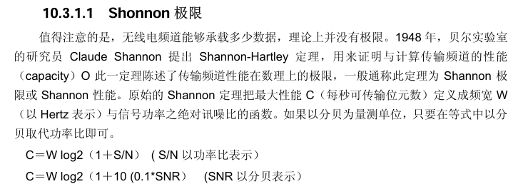

# 引言

我在项目里面加了一个学习资料区，目的是推荐网络相关的学习资料。

接下来让我评价一本网络相关的书籍：《无线网络权威指南》

很显然，我对网络的研究主要集中在传输和拥塞控制领域，但wifi这种第2层的也是有所涉猎的，考虑到这是一本公认的学习书籍，所以写一下我的理解和体会还是有必要的。

作为oreilly动物世界书籍，wifi很显然对应的是蝙蝠，发射信号波的飞天大耗子。

# 论wifi

其实如果你对各类协议栈有所接触，你会发现，从传输来说，跟TCP/IP都是非常像的，但是wifi作为下2层的网络，真正特殊的地方在于与物理世界的接触。

各人学习的侧重点不同，我学习中的wifi主要分为这样的几大块：

* MAC、分布式、竞争访问
* 数据帧可靠传输
* 速率控制
* 安全、加密、认证
* 信息论、信道的由来
* 物理、OFDM、傅里叶、信号与系统、数字信号处理

所以对于这一本书，我的视角也随着以上内容展开。

# 论本书

但是我要说的是，这并不是一本可以从头读到尾的书，起码对于我关心的内容来说不是。

这一本书包含规范，概括概念，但唯独不会告诉你到底什么是wifi。

毫不客气的说：内容就像糨糊！你只能一点点从中过滤你需要的养分。

为此，我给的建议就是，可以阅读一些经典源代码，比如我当时初步学习时就用的是Linux6.6的源码。

## 论章节

首先让我们看看第一章和第二章，这两章主要是介绍wifi版本协议规范、作用之类的：

对于这两章，我的建议就是看看概念，知道各个wifi版本标准、懂一点术语概念就行了。

第一章 无线网络导论

1. 为何需要无线？
2. 无线网络的特色
3. 各式各样的网络

第二章 802.11 网络概论

1. IEEE 802 网络技术族谱
2. 802.11 相关术语及其设计
3. 802.11 网络的运作方式
4. 移动性的支持

接下来来到第三章，这一章就很重要了：

## MAC、分布式、竞争访问

第三章 802.11 MAC 基础

1. MAC 所面临的挑战
2. MAC 访问模式与时机
3. 利用 DCF 进行基于竞争的访问
4. 帧的分段与重组
5. 帧格式
6. 802.11 对上层协议的封装
7. 基于竞争的数据服务
8. 数据的处理与桥接

首先我们要知道，wifi是在空气中传播的，会有波动，会有干扰。

对于有线网络来说，只要两边网线一接，那么连接就好像万事大吉了。

但是对于wifi来说，没这么简单，因为，只要信号能达到，那么就可以传输数据。

这引出了一个概念：mac，也就是媒介访问控制层。

其实对于这一章吧，我觉得，你只要知道：

* 数据传输的确认靠ack
* DCF、载波侦听、帧间隔、NAV，随机退避、访问、失败恢复、隐藏节点

这些真够混乱的，我们要了解的就是wifi为了避免竞争做了多大的努力就行了。

接下来就没必要按照章节来了，我调一下我感兴趣的讲讲吧：

## 数据可靠传输

实现可靠传输有很多办法，比如FEC、ARQ、网络编码。

讲讲ARQ（Automatic Repeat reQuest），自动重传：

即：

* 发送，如果收到ACK，成功

否则

* 发送，未收到ACK，重传

Wi-Fi 的 ACK 重传机制就是典型 ARQ，当然，802.11 OFDM也大量使用FEC，

如果抓到 Block ACK 帧，就能看到里面的确认位图。

Block ACK：起始序列号 + 位图，批量确认数据，缺失项继续重传。

如果你熟悉tcp，那么类比 SACK，但确认单位是 MPDU，不是 TCP 字节区间。

我在 mac80211 的发送状态反馈里没看到直接上报 Block ACK 位图；驱动上报的是每帧 ACK 状态，或者 A-MPDU 的确认数。那么位图怎么看呢？

是这样的：

首先，如果上层交下来一大段数据，无脑装进一个很大的帧里发，只要有一个 bit 搞坏整帧，整帧就得重传。拆成小帧可以缩小重传范围，但每帧都有首部开销。

但其实这里存在一个数学问题，接下来我会仔细讨论。

总而言之，发送数据包时，是：

* 把数据帧挂到队列上，一个个编号，比如0，1，2
* 对面收到0，2，ack表现就是数据包位图里面的101
* 发送端看到101，知道1丢了，所以继续重传1

### 关于数据首部和大小

假设有一大段数据，要切成 payload 长度为L个 bit 的小包。每个小包还有固定 header：

$$
H \text{ bits}
$$

假设每个 bit 独立出错概率：

$$
p
$$

那么一个包总长度为：

$$
L+H
$$

整个包完全无错误的概率就是：

$$
P_{\rm success}=(1-p)^{L+H}
$$

如果一个包坏了就整个重传，那么成功发出一个包所需要的平均发送次数：

$$
E[N]=\frac{1}{P_{\rm success}}=\frac{1}{(1-p)^{L+H}}
$$

所以，为了成功交付L个 bit 有效数据，平均实际发送的数据量是：

$$
E[B]=\frac{L+H}{(1-p)^{L+H}}
$$

于是发送效率可以写成：

$$
\eta(L)=\frac{L}{E[B]}=\frac{L}{L+H}(1-p)^{L+H}
$$

第一项：

$$
\frac{L}{L+H}
$$

包越大，header 占比越小，效率说不定越高。

第二项：

$$
(1-p)^{L+H}
$$

包越大，被某个 bit 搞坏的概率越高，所以越差。

所以，必然存在一个最优包长，ok，知道有这么个东西就行了，其实我们已经讲偏了。

继续回到正题吧。

### 第四章：wifi帧封装

这一章就别看了，看了也记不住的，也没必要记。

## 速率控制

这本书上没有（印象中没看到过），但是对于排查wifi为什么这么慢是很重要的。

其实wifi的速率控制有一点点像TCP的拥塞控制，但不多。wifi会尝试不同的速率，看看哪一个最好。

你可能会想，是不是我发得越多，速率越高，不就越好吗？

这就是典型的没学过信息论，也没联系生活实践，有一种没被知识污染过的美，比盯帧还纯真。

想一想每天上下班的地铁，车厢就那么点大，来的人再多，也只能送这么多人。

人越多，反而越拥挤，最终甚至可能发生踩踏事件。

感兴趣的自己去看看Linux6.6的源码：

### Linux v6.6 实现与反馈

| 对象                                             | 原始材料                                                     |
| ------------------------------------------------ | ------------------------------------------------------------ |
| 公共软件算法 `minstrel_ht`；legacy/HT/VHT 速率组 | [`rc80211_minstrel_ht.c`](https://github.com/torvalds/linux/blob/v6.6/net/mac80211/rc80211_minstrel_ht.c) |
| 定点格式、滤波系数、状态结构                     | [`rc80211_minstrel_ht.h`](https://github.com/torvalds/linux/blob/v6.6/net/mac80211/rc80211_minstrel_ht.h) |
| 反馈入口 `rate_control_tx_status()`              | [`rate.c`](https://github.com/torvalds/linux/blob/v6.6/net/mac80211/rate.c#L63) |
| 驱动／固件自主控速                               | [`IEEE80211_HW_HAS_RATE_CONTROL`](https://docs.kernel.org/6.6/driver-api/80211/mac80211.html#c.ieee80211_hw_flags) |

## 加密、安全、认证、过程管理

这本书太老了，很多东西感觉已经过时了。

我建议直接一步到位，学一下AES、eap、wpa、wpa2、sae、wpa3，以及椭圆曲线加密就行了。

既然学这些，那么就不可避免要谈一下wifi的握手，如果能抓包学习那最好。

配置不同的加密，有不同的建立连接的方式，最经典的是 wifi 的四次握手（WPA2）。但是在 WPA3-Personal 中，先有 SAE 认证，后面仍然有四次握手，SAE 可以使用椭圆曲线群，我印象中用的是“蜻蜓算法” [RFC 7664](https://www.rfc-editor.org/rfc/rfc7664.html)。

说到椭圆加密，我当时还写过一点笔记：[linux6.6源码: wifi与椭圆曲线加密算法 - 知乎](https://zhuanlan.zhihu.com/p/2023824655690023281)

至于过程管理，我只能说这一章节全是废话，懂的都懂，不懂的看了也不懂。

接下来就整点有意思的东西。

从第十章开始，就是物理层的东西了。

很显然，我是文盲，一个字都看不懂。

# 信息论、信道的由来

这是有意思的地方，我最近刚好在看香农的论文：

首先我们要明白通信交流的本质，比如你打开百度，搜索一个关键字，

你要做的就是从无数个链接中选出你需要的那一个。

我们用一个bit表示信息时，一个bit有两种可能性，要么是0，要么是1.

也就是说，当我们的信息有8个bit，我们需要从中选择一串符合我们要求的数字，那么共有2^8种组合。

信息衡量一种很常用的方法就是使用log来表示，香农给出了三个原因：

1. **它在实际应用中更有用。**
   工程上重要的参数，例如时间、带宽、中继器数量等，往往与可能情况数量的对数呈线性变化。
   例如，在一组中继器中增加一个中继器，会使这些中继器可能的状态数翻倍；而以 2 为底的对数只增加 1。
   又例如，将时间加倍，会使可能消息的数量大致变为原来的平方，也就是使其对数加倍，等等。
2. **它更接近我们对合适度量的直觉。**
   这一点与第 1 条密切相关，因为我们在直觉上习惯用线性方式，把事物与常用标准进行比较。
   例如，我们会觉得，两张穿孔卡片用于存储信息时，其容量应该是一张卡片的两倍；两条相同的信道用于传输信息时，其容量也应该是一条信道的两倍。
3. **它在数学上更加合适。**
   许多极限运算在使用对数表示时会变得很简单；如果改用可能情况的数量来表示，则需要用更加笨拙的方式重新表述。

那么，用log表示的话，十进制相对二进制含有多少信息量呢？转换公式是：

$$
\log_2 M=\frac{\log_{10}M}{\log_{10} 2}=3.32\,\log_{10}M
$$

常见的通信系统可以分为三类：连续、离散、混合。

但不管是哪一类系统，中间通信的那条通道，都被称之为信道。

容量=带宽 * 单位带宽的信息承载能力。

所以，这本书引用了香农极限：

# ofdm与信号处理

接下来可以看看第十三章，不得不说，书上讲得是真的垃圾，

我简单讲讲ofdm正交吧，

802.11a 是以正交分频多工（orthogonal frequency division multiplexing，简称 OFDM）为基础，把带宽切成很多个彼此正交的窄带子载波，同时慢慢发送。

简单来说，处理信号的时候，接收端用目标信号基函数做投影，其他的由于正交，积分运算为0，只留下目标信号的，进而提取目标信息了。

# 最后

综合评价，在我看过的书里面，这本书算一般吧，不好也不坏，像一团浆糊的书。

学wifi应用和原理又没什么帮助，当字典查又过时且不如规范文档，为数不多的好处就是整理详细。

放到今天的AI 时代，这种把一堆规范和术语缝在一起的书，真没什么稀缺性了。

